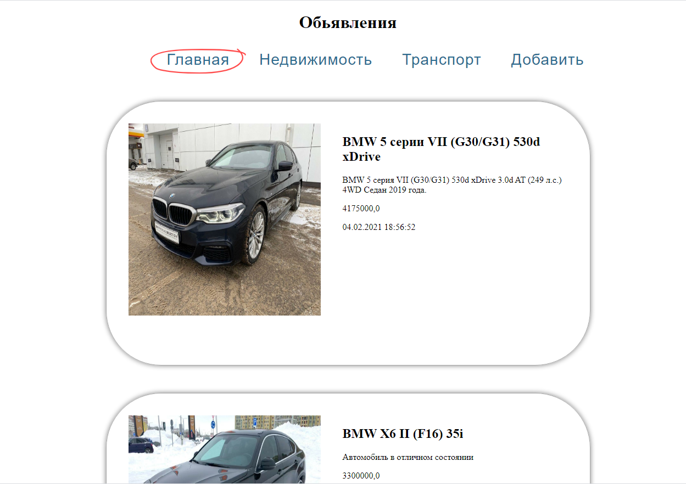
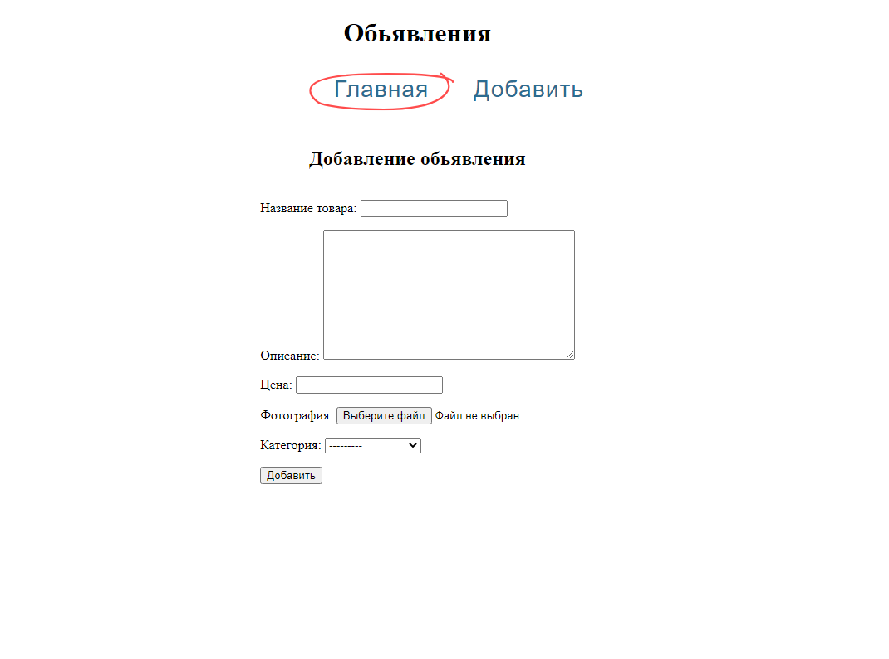

# Callboard - доска обьявлений на Django
Из основных возможностей на данный момент: 

1)Добавление обьявления 

2)Возможность добавлять категории

В качестве базы данных применена SQLite  

Реализованы отношения OneToMany между таблицами

 

Добавление обьявления    

